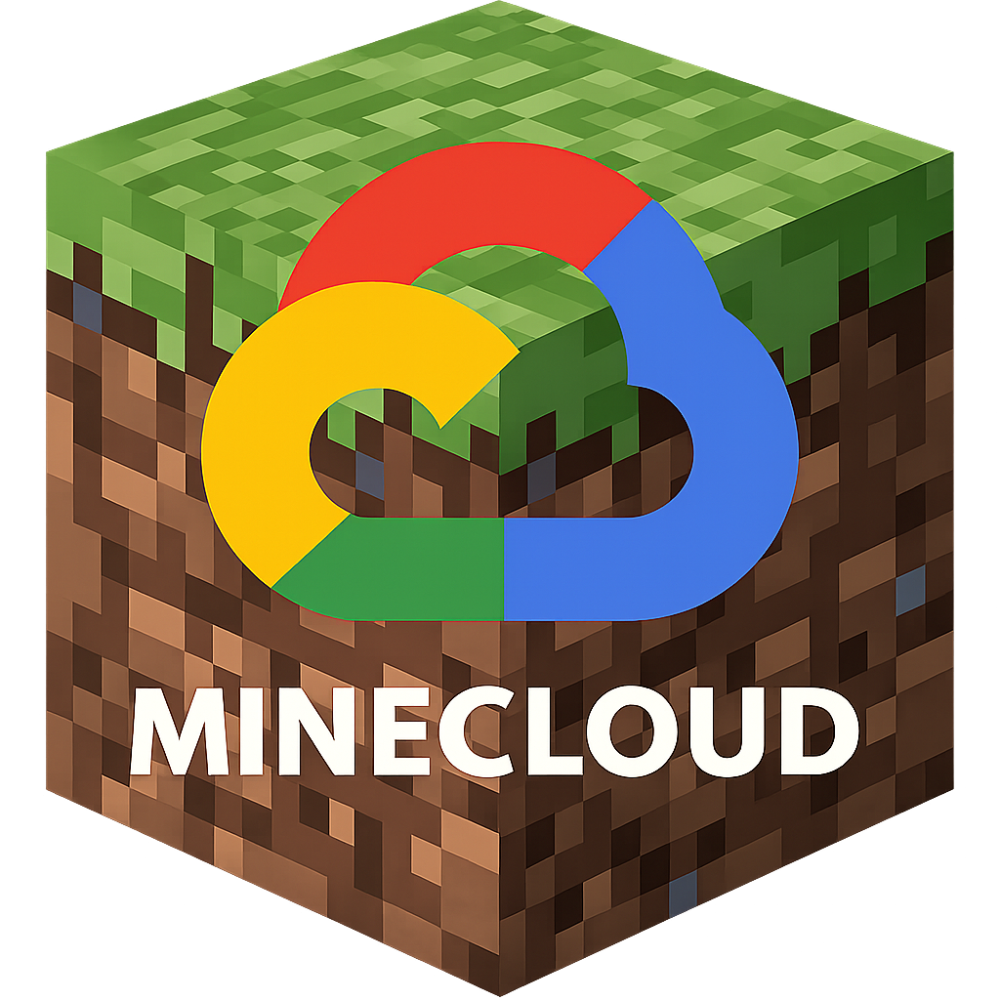

<div align="center">



# MineCloud
### Secure Google Drive-Based Minecraft Server Cloud Management Platform

<p align="center">
  <strong>Manage, Synchronize, Backup, and Secure your Minecraft Server from Anywhere.</strong>
</p>

<p align="center">
  
  
  
  
</p>

---

A modern cloud-based Minecraft server management platform that securely synchronizes worlds through **Google Drive**, provides **encrypted user management**, **cloud backups**, **permission control**, and a complete **administration console** for managing multiplayer server deployments.

Designed for server owners who want a lightweight alternative to expensive hosting panels while keeping complete control over their own cloud storage.

</div>

---

# ✨ Features

## 🔒 Security

- AES‑grade Fernet encryption for all sensitive cloud files
- Encrypted backend database (accounts, tokens, settings)
- Secure Google OAuth authentication (no static API keys)
- SHA‑256 password hashing for user accounts
- One‑time activation strings (consumed immediately, never reusable)
- Admin ownership verification (must be the Drive folder owner)
- User approval workflow (pending → approved)
- Encrypted local vault tied to the machine (salt + key derivation)
- Cloud permission management via Google Drive API
- Audit logging for every administrative action

---

## ☁️ Cloud Infrastructure

- Google Drive integration (Backend & Server folders)
- Automatic cloud synchronization (download & upload)
- Incremental world backups via Drive revisions
- Backup integrity verification (MD5 checksums)
- Backup rollback (restore any previous revision)
- Cloud revision history browser
- Version tracking with local `sync_version.dat` files
- Smart‑sync: avoids redundant downloads when world is up‑to‑date

---

## 👥 User Management

- Activation‑based registration (no permanent invitation tokens)
- Auto‑approval in **Public** mode, manual approval in **Restricted** mode
- Login with optional **Remember Me** (session saved in encrypted vault)
- **Reauthenticate Account** button on email mismatch
- Bulk approve / revoke with checkboxes
- User search and sorting (by name, date, status)
- Email‑based Google Drive permissions

---

## 🎮 Minecraft Management (Client)

- Launch & stop server with one click
- Auto‑detect `.bat` and `.jar` executables in world folder
- **Optional RAM configuration** for `.bat` files (displayed clearly as default or custom)
- Live server console with command input
- Server state monitoring (online / stopped)
- Parallel HTTP download using Range requests for fast world retrieval
- **Automatic mode**: world stored in `%APPDATA%\MineCloud\server`
- **Manual mode**: choose any folder for the world, set executable manually
- Smooth transfer of world files when switching between modes
- Clear world with confirmation and console reset
- `.jar` servers run with `java -jar`, ensuring console output and proper stop

---

## ⚙️ Administration (Master Manager)

- Infrastructure setup wizard (Backend/Server folder IDs, OAuth secret)
- Google Drive authentication with ownership verification
- One‑time activation string generation (base64‑encoded payload)
- Activation strings management (view, copy, clear all)
- User management with compact cards, search, sort, refresh
- Bulk approve / reject pending users
- Folder permission manager (Public / Restricted toggle)
- Automatic permission sync after initialization
- Rollback manager: view revision timeline, restore any previous backup
- Delete backup file (removes all revisions)
- Configuration backup & import (portable, encrypted, embeds OAuth secret)
- Backend repair & reset (rebuilds encrypted files)
- Logout from Setup tab (mutually exclusive with Reauthenticate button)

---

# 🏗 Architecture

```
                         Google Drive

            ┌────────────────────────────┐
            │      Backend Folder        │
            │────────────────────────────│
            │ accounts.json (encrypted)  │
            │ tokens.json (activation    │
            │            strings)        │
            │ folder_settings.json       │
            │ audit_log.json             │
            │ access_config.enc          │
            └─────────────┬──────────────┘
                          │
                  Fernet Encryption
                          │
        ┌─────────────────┴─────────────────┐
        │                                   │
 Master Manager                      Client Console
 (Administrator)                     (Server Owner)
        │                                   │
        └───────────────┬───────────────────┘
                        │
                        ▼
             Google Drive Server Folder
                        │
                world_backup.zip
```

---

# 🔑 Backend Files

All backend files are encrypted using Fernet encryption (except `audit_log.json` and `access_config.enc`, which is encrypted with a separate activation key).

| File | Purpose |
|------|----------|
| accounts.json | Registered users (username, email, hashed password, status) |
| tokens.json | List of unused activation strings (each consumed upon use) |
| folder_settings.json | Permission mode (`public` or `restricted`) |
| audit_log.json | Administrative logs (plain JSON) |
| access_config.enc | Bootstrap payload for clients (activation‑key encrypted) |

---

# 🛡 Security

MineCloud uses a layered security model.

- Google OAuth Authentication (Desktop application flow)
- Fernet Encryption (AES‑CBC + HMAC) for all sensitive cloud files
- SHA‑256 Password Hashing
- One‑time Activation Strings (deleted from cloud immediately after use)
- Admin Ownership Verification (ensures only the Drive folder owner can initialize)
- User Approval Workflow
- Google Drive Permission API (individual user permissions)
- Encrypted Local Vault (key derived from machine‑specific salt + hardcoded seed)
- Audit Logging (every admin action is recorded)
- Portable Backup Encryption (fixed application key for cross‑machine restore)

No backend credentials are ever exposed to end users.

---

# ⚡ Technologies Used

| Component | Technology |
|-----------|------------|
| Language | Python 3.11+ |
| GUI | CustomTkinter |
| Google APIs | Google Drive API v3, OAuth2 |
| Cryptography | cryptography (Fernet), hashlib (SHA‑256) |
| Networking | requests, socket, ssl |
| Concurrency | threading, concurrent.futures |
| Compression | zipfile |
| System | subprocess, os, io, time, shutil, ctypes |

---

# 🔧 Google Cloud Setup (Required for Master)

1. **Create a Google Cloud Project**  
   Go to [Google Cloud Console](https://console.cloud.google.com/), create a new project (or use an existing one).

2. **Enable the Google Drive API**  
   Navigate to **APIs & Services > Library**, search for "Google Drive API", and enable it.

3. **Configure the OAuth consent screen**  
   - Go to **APIs & Services > OAuth consent screen**.  
   - Choose **External** user type and click **Create**.  
   - Fill in the required fields (App name, user support email, developer contact).  
   - On the **Test users** page, add **your own email address** (the admin account). Click **Save and Continue**.  
   - After saving, go back to the OAuth consent screen and click **Publish App** under **Publishing status**. This moves the app to "In production". End users will see an unverified app warning, but can proceed without any manual email additions by the admin in the Google Cloud Console.

4. **Create OAuth 2.0 Client ID**  
   - Go to **APIs & Services > Credentials**.  
   - Click **Create Credentials > OAuth client ID**.  
   - Choose **Desktop app** as the application type.  
   - Name it (e.g., "MineCloud").  
   - Click **Create** and download the resulting `client_secret.json` file.  

5. **Create your Google Drive folder structure**  
   - In your Google Drive, create a main folder for your server – for example, **`Minecraft Server`**.  
   - Inside it, create two subfolders:  
     - **`Backend`** – will store the encrypted backend files (accounts, tokens, settings).  
     - **`World`** – will hold the world backup (`world_backup.zip`).  
   - **Crucial:** Right‑click the **`Backend`** folder, select **Share > General access**, and change it to **Anyone with the link** and **Editor**. This allows clients to interact with the backend files securely.  
   - Open each subfolder in your browser and copy its ID from the URL: `https://drive.google.com/drive/folders/<FOLDER_ID>`. You will need both IDs during Master Manager setup.

---

# 📦 Prepare Your World Backup

Before the Master Manager can synchronize anything, you need an initial world backup to upload.

1. **Create your Minecraft server world** – this can be any version (Vanilla, Forge, Fabric, etc.) and any modpack. Set up all the files, mods, and configuration exactly how you want them.

2. **Place all server files** in a single folder. Make sure the folder contains everything needed to run the server (executable `.bat` or `.jar`, `server.properties`, `mods/`, `world/`, etc.).

3. **Zip the folder correctly** – this step is critical:  
   - Select **all the files and folders inside** your server folder (not the folder itself).  
   - Right‑click and choose **Send to > Compressed (zipped) folder**.  
   - Rename the zip file to **`world_backup.zip`**.  
   - When you open the zip, you should see the server files directly (e.g., `server.jar`, `start.bat`, `world/`, `mods/`) **without** an extra wrapper folder.

4. **Upload the zip** – manually upload `world_backup.zip` to the **`World`** folder you created in Google Drive. This will be the initial backup that all clients download.

The Master Manager will then manage updates, revisions, and distribution automatically.

---

# 🖥 Master Manager Setup

1. **Run `master_manager.py`**  
   Launch the application. On the Setup tab, fill in:
   - **Backend Folder ID** – the ID of the **`Backend`** folder you created.
   - **Server Folder ID** – the ID of the **`World`** folder (where `world_backup.zip` lives).
   - **OAuth Secret JSON** – browse and select the `client_secret.json` file you downloaded earlier.

2. **Click Initialize Infrastructure**  
   The app will open your browser for Google authentication. Sign in with the account that **owns** the Backend folder (ownership was verified during setup). If another account is used, you'll see an error and can click **Reauthenticate Account** to try again.

3. **Successful connection**  
   A green "Connected" badge appears. The app automatically:
   - Makes the Backend folder publicly writable (so clients can interact via shared links).
   - Syncs the actual Server folder permission mode with `folder_settings.json`.
   - Creates or verifies the encrypted backend files.
   - Re‑uploads `access_config.enc` (the bootstrap file for clients).

4. **Generate activation strings**  
   Switch to the **Activation** tab and click **Generate New Activation String**. Copy the string and give it to a client.

5. **Manage users**  
   In the **Users** tab you can search, filter, approve, reject, or revoke users. Use **Refresh** to reload the list.

6. **Folder permissions**  
   Under **Folder Permissions**, you can toggle between **Public** (auto‑approve new users) and **Restricted** (manual approval). When switching to Restricted, all approved users are automatically added as editors to the Server folder.

7. **Rollback & maintenance**  
   Use the Rollback tab to view and restore previous world backups. The Settings tab lets you back up your configuration (including the OAuth secret), import a backup, clear all local data, or repair the backend.

---

# 💻 Client Console Setup

1. **Get an activation string** from your admin.  
2. **Run `mc_manager.py`** – the activation screen appears. Paste the string and click **Activate**.  
   The client will:
   - Decode the string, download `access_config.enc`, decrypt it, and obtain the encryption keys and folder IDs.
   - Authenticate with Google (you will be prompted in your browser).
   - Remove the used activation string from the cloud.

3. **Register or Sign In**  
   - If you're a new user, click the **Register** tab. Enter a username, your Google email, and a password.  
   - If the server is in **Public** mode, your account is immediately approved and you're logged in.  
   - In **Restricted** mode, your account is created as **pending** and you must wait for admin approval.  
   - To log in, use your username or email and password. If you accidentally use the wrong Google account, a **Reauthenticate Account** button appears – click it to switch.

4. **First‑time download**  
   - The first time you launch the client, you'll be asked to choose **Automatic** or **Manual** world storage.  
   - **Automatic**: the world is stored in `%APPDATA%\MineCloud\server`. Everything is handled automatically.  
   - **Manual**: you choose a folder on your PC. You'll need to set the **Server Directory** and later the **Server Executable** manually.

5. **Using the dashboard**  
   - **Download World / Start Server** button: downloads the latest world backup if you don't have it, or starts the server if it's up‑to‑date.  
   - **Sync to Cloud**: after stopping the server, click to upload your world.  
   - **Console**: send commands directly to the server (e.g., `say Hello`).  
   - **Clear World**: deletes the local world and resets the configuration (executable path, RAM settings).  
   - **Clear Credentials**: erases all local activation data – you'll need a new activation string.  
   - **Server Location**: switch between Automatic and Manual modes. If a world exists, you'll be prompted to move it.  
   - **Edit RAM** (automatic mode, `.bat` only): change the minimum and maximum RAM for the server. The default values from the `.bat` are shown in the configuration card as `[Default RAM]`.

6. **RAM information**  
   In **Manual** mode, after selecting a `.bat` executable, the Server Configuration card shows either `[Default RAM]: Minimum Allocated RAM: XGB | Maximum Allocated RAM: XGB` (if you haven't customised it) or your custom values. In **Automatic** mode, the same info appears below the server status.

7. **Logout** clears your session and Google token – the next user will start fresh.

---

# 🔄 Synchronization Flow

```
Local Server World
        │
        ▼
Generate ZIP Backup
        │
        ▼
Calculate SHA256 Signature
        │
        ▼
Compare MD5 with Cloud Version
        │
        ▼
Upload if Changed (new revision)
        │
        ▼
Cloud Backup Updated
```

---

# 🔐 Activation & Registration Workflow

```
Admin (Master Manager)
        │
        ▼
Generate Activation String
        │
        ▼
User (Client) Pastes String
        │
        ▼
String Validated & Removed from Cloud
        │
        ▼
User Registers / Logs In
        │
        ▼
Auto‑Approved (if Public) or Pending (if Restricted)
        │
        ▼
Minecraft Dashboard
```

---

# 📖 Permission Modes

## 🌍 Public

- Anyone with the link can edit the server folder.
- Newly registered accounts are **automatically approved**.
- No admin interaction required for user access.

---

## 🔒 Restricted

- Only specifically approved users receive Google Drive write permissions.
- New accounts enter a **pending queue** until an admin approves them.
- Ideal for private, invite‑only servers.

---

# 💾 Backup System

MineCloud automatically:

- Compresses the server world
- Uploads to Google Drive
- Tracks cloud revisions (full history)
- Prevents duplicate uploads via MD5 comparison
- Verifies integrity with version files
- Supports instant rollback to any previous revision
- Downloads the latest backup automatically on version mismatch

The **Master Manager** can also create a portable encrypted backup of the entire configuration (keys, folder IDs, OAuth secret) for disaster recovery.

---

# 📈 Current Features (Summary)

- ✅ Google Drive Cloud Storage with encryption
- ✅ Automatic World Backup & Smart Sync
- ✅ One‑time Activation Strings
- ✅ User Authentication & Registration
- ✅ Permission Management (Public/Restricted)
- ✅ Audit Logging
- ✅ Backup Rollback (Revision History)
- ✅ Live Server Console
- ✅ Server Launcher with Executable Detection
- ✅ Optional RAM Configuration for .bat Servers (clear Default/Custom display)
- ✅ Auto/Manual Server Location Modes with seamless world transfer
- ✅ Session Management & Remember Me
- ✅ Encrypted Backend & Local Vault
- ✅ Admin Ownership Verification
- ✅ Portable Configuration Backup & Import
- ✅ Parallel Fast Download
- ✅ Clear World with full state reset
- ✅ .jar server support (console output & proper stop)
- ✅ Utility buttons blocked during server run
- ✅ Reauthenticate Account on email mismatch

---

# 🤝 Contributing

Contributions, suggestions, and feature requests are welcome.

Feel free to open an Issue or submit a Pull Request.

---

<div align="center">

## ⭐ If you like MineCloud, consider giving the repository a star!

Built with ❤️ using Python, Google Drive API, and CustomTkinter.

</div>
